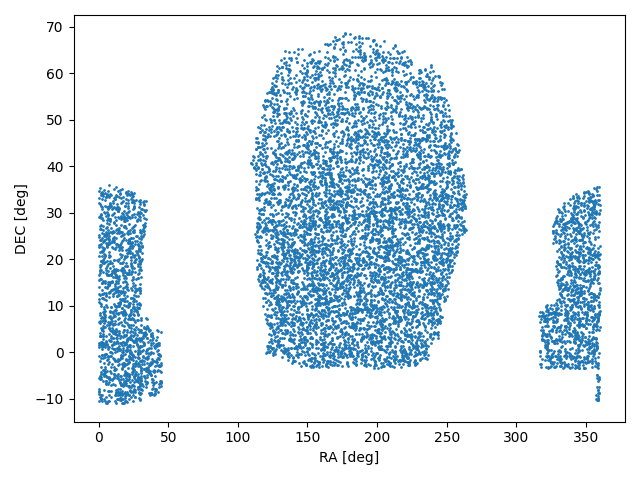

.. RandomSDSS documentation master file, created by
   sphinx-quickstart on Thu Jul 15 20:08:52 2021.
   You can adapt this file completely to your liking, but it should at least
   contain the root `toctree` directive.

RandomSDSS's documentation!
======================================

.. image:: https://badge.fury.io/py/RandomSDSS.svg
    :target: https://badge.fury.io/py/RandomSDSS
    :alt: PyPI
    
.. image:: https://github.com/mchalela/RandomSDSS/actions/workflows/randomSDSS_ci.yml/badge.svg
   :target: https://github.com/mchalela/RandomSDSS/actions/workflows/randomSDSS_ci.yml
   :alt: Build Status
   
.. image:: https://readthedocs.org/projects/randomsdss/badge/?version=latest
   :target: https://randomsdss.readthedocs.io/en/latest/?badge=latest
   :alt: Documentation Status

.. image:: https://coveralls.io/repos/github/mchalela/RandomSDSS/badge.svg?branch=main
   :target: https://coveralls.io/github/mchalela/RandomSDSS?branch=main

.. image:: https://img.shields.io/badge/License-MIT-blue.svg
   :target: https://tldrlegal.com/license/mit-license
   :alt: License

Generate random points in Sloan Digital Sky Survey (SDSS) DR8 to DR16 footprints.

This is a small wrapper around the package pymangle that facilitates
the creation of random points in the SDSS fields. I included 
SDSS polygons for its different data releases (DR8 to DR16).

Basic Usage
-----------

.. code-block:: python

   import matplotlib.pyplot as plt
   import randomsdss

   dr12 = randomsdss.DR12(catalog="BOSS")
   ra, dec = dr12.random(size=10_000)

   plt.figure()
   plt.scatter(ra, dec, s=1)
   plt.xlabel('RA [deg]')
   plt.ylabel('DEC [deg]')

Alternatively, you can get the same result without the need to 
instantiate an object using:

.. code-block:: python

   ra, dec = randomsdss.sky_random(dr="DR12", catalog="BOSS", size=10_000)

If you also need a random redshift distribution you can provide a sample
of redshifts and a random set will be generated from the underlying 
Probability Density Function (PDF):

.. code-block:: python

   z = randomsdss.z_random(z_array, size=10_000)

The z_random is a complementary function since it does not use any 
information regarding the SDSS catalogs, only the provided redshift array. 

| **Author**
| Martin Chalela (E-mail: tinchochalela@gmail.com)

Repository and Issues
---------------------

https://github.com/mchalela/RandomSDSS

.. toctree::
   :maxdepth: 2
   :caption: Contents:

   randomsdss
   installation
   licence   
